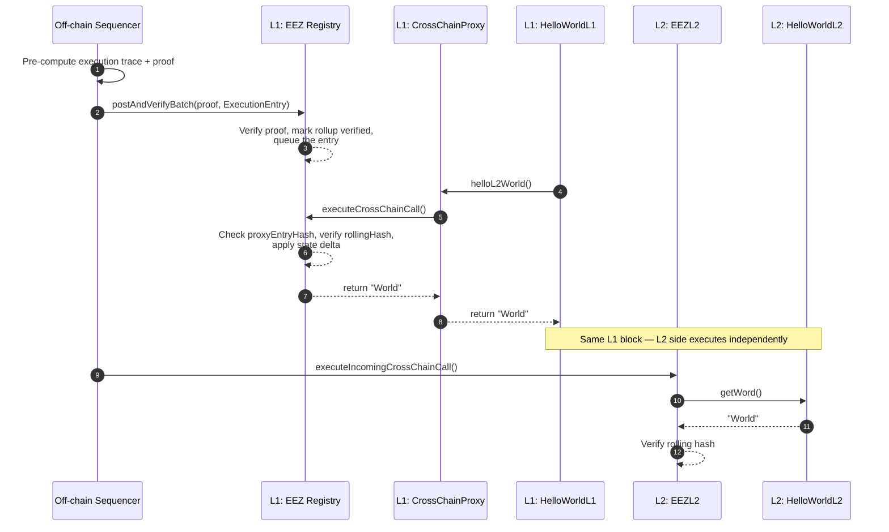

```mermaid
sequenceDiagram
    autonumber
    participant Seq as Off-chain Sequencer
    participant EEZ as L1: EEZ Registry
    participant Proxy as L1: CrossChainProxy
    participant AppL1 as L1: HelloWorldL1
    participant EEZL2 as L2: EEZL2
    participant AppL2 as L2: HelloWorldL2

    Seq->>Seq: Pre-compute execution trace + proof
    Seq->>EEZ: postAndVerifyBatch(proof, ExecutionEntry)
    EEZ-->>EEZ: Verify proof, mark rollup verified,<br/>queue the entry
    AppL1->>Proxy: helloL2World()
    Proxy->>EEZ: executeCrossChainCall()
    EEZ-->>EEZ: Check proxyEntryHash, verify rollingHash,<br/>apply state delta
    EEZ-->>Proxy: return "World"
    Proxy-->>AppL1: return "World"
    Note over AppL1,AppL2: Same L1 block — L2 side executes independently
    Seq->>EEZL2: executeIncomingCrossChainCall()
    EEZL2->>AppL2: getWord()
    AppL2-->>EEZL2: "World"
    EEZL2-->>EEZL2: Verify rolling hash
```
