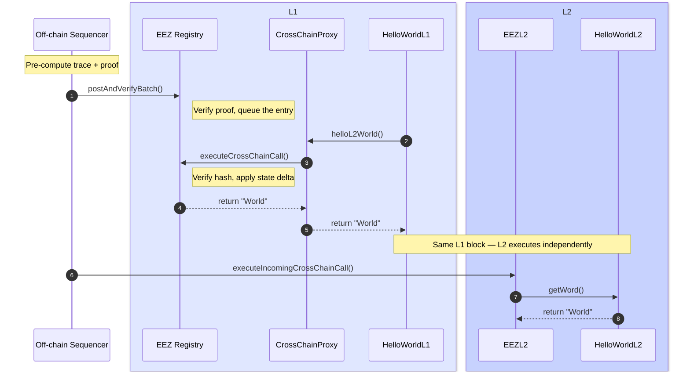

```mermaid
sequenceDiagram
    autonumber
    participant Seq as Off-chain Sequencer
    box rgb(224,231,255) L1
    participant EEZ as EEZ Registry
    participant Proxy as CrossChainProxy
    participant AppL1 as HelloWorldL1
    end
    box rgb(199,210,254) L2
    participant EEZL2 as EEZL2
    participant AppL2 as HelloWorldL2
    end

    Note over Seq: Pre-compute trace + proof
    Seq->>EEZ: postAndVerifyBatch()
    Note right of EEZ: Verify proof, queue the entry
    AppL1->>Proxy: helloL2World()
    Proxy->>EEZ: executeCrossChainCall()
    Note right of EEZ: Verify hash, apply state delta
    EEZ-->>Proxy: return "World"
    Proxy-->>AppL1: return "World"
    Note over AppL1,AppL2: Same L1 block — L2 executes independently
    Seq->>EEZL2: executeIncomingCrossChainCall()
    EEZL2->>AppL2: getWord()
    AppL2-->>EEZL2: return "World"
```
