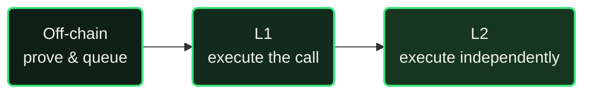
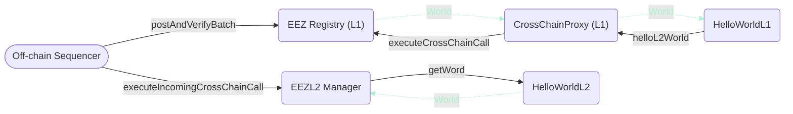

At a glance, every cross-rollup call goes through three stages:

The full call, contract by contract, for `HelloWorldL1.helloL2World()` calling through to `HelloWorldL2.getWord()`:

Solid green arrows are calls, dashed mint arrows are returns (mint marks a settled/proven value in the EEZ visual grammar). `EEZ.postAndVerifyBatch()` verifies the proof and queues the entry; `EEZ.executeCrossChainCall()` checks the hash and applies the state delta. Both sides happen in the same L1 block — see [Execution flow: a complete example](#execution-flow-a-complete-example) below for the step-by-step breakdown.
