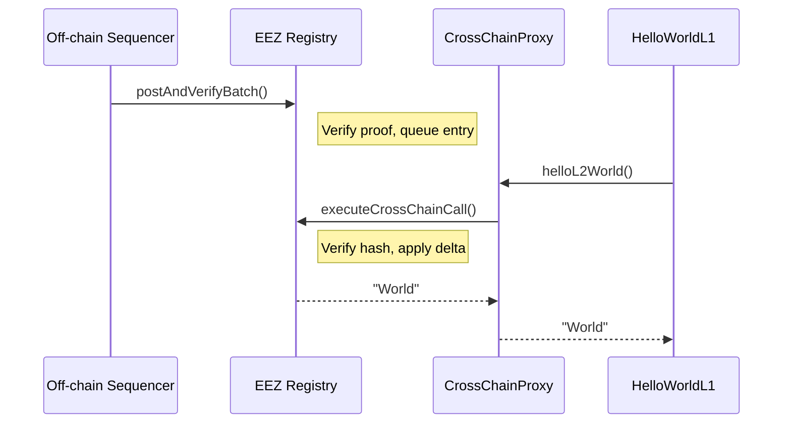
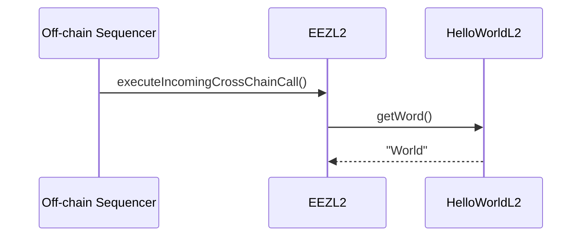

**Phase 1 — L1: prove, queue, execute the call.** The sequencer pre-computes the trace and proof, EEZ verifies and queues it, then `HelloWorldL1`'s call routes through the proxy and back:

**Phase 2 — L2: same L1 block, executed independently.** The system address drives the L2 side of the same call, verified against its own rolling hash:

