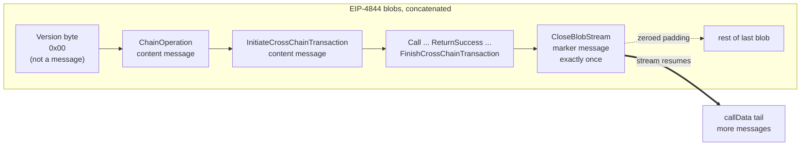

import UnauditedWarning from '../_unaudited-warning.mdx'

<UnauditedWarning />

EEZ publishes chain activity — native transactions, cross-chain calls, their results, forced reverts, and transaction boundaries — as a single binary stream of messages, with no header. Every one of those event kinds differs from every other only by its **message type**; there is exactly one exception, a single reserved byte at the very start of the stream. This is the wire format a batch's EIP-4844 blobs (and trailing calldata) actually contain: the logical byte stream — packed into the blobs' field elements, not stored verbatim (see below) — whose hash gets folded into the [public inputs hash](/concepts/multi-prover#the-public-inputs-hash) that every proof system verifies against.

## Framing: One Reserved Byte, Then a Stream of Messages

The first byte of the stream is the **protocol version** — hardcoded `00` for this version of the format. It is reserved in every blob stream and is the one thing in the stream that is **not** itself a message. Everything after it is messages.

Every message begins with a `message_type` byte, which selects one of two shapes:

* **Content messages** carry data: `message_type` followed by the type's own fields.
* **Marker messages** carry no fields at all: a lone `message_type` byte.



`CloseBlobStream` marks the end of meaningful content in the blob portion of the stream. It is mandatory and must appear exactly once; every byte after it, up to the end of the last blob, is zero padding that readers skip. The stream then **resumes in the batch's `callData`** — `CloseBlobStream` cannot legally appear a second time there, since there are no more blobs left to close.

## Wire Encoding Conventions

A handful of encoding rules apply uniformly across every message type's fields:

- **Scalars are little-endian and fixed-width**: `u8` / `u16` / `u32` / `u64` / `u128` / `u256`, exactly as wide as written. `bool` is one byte; `address` is 20 bytes.
- **`bytes` fields use protobuf-style length-prefixing**: a [varint](https://protobuf.dev/programming-guides/encoding/#varints)-encoded length, then exactly that many payload bytes. All four `bytes` fields in the format (`operations`, `tx_data`, `data`, `return_data`) are encoded this way, regardless of whether their contents are protocol-defined or opaque to the protocol:

  ```
  ac 02                  ← varint(300), 2 bytes
  d0 9e … (300 bytes)    ← the payload itself, as-is
  ```

- **Blob layout**: the logical byte stream is the batch's EIP-4844 blobs, in order, concatenated — with the batch's `callData` appended after the last blob, as one continuous stream. A message may span a blob boundary; the next blob simply continues the stream where the last one left off.

<details>
<summary>For builders: physical packing into a blob's field elements</summary>

An EIP-4844 blob is 4096 field elements of 32 bytes each, and every element must be a valid BLS12-381 scalar (below the field modulus). Each field element carries 31 bytes of stream data; its 32nd byte is unused and must be zero, which keeps every element well under the modulus regardless of its data bytes. Elements are read least-significant-byte first, so the unused zero byte is the most significant one read last — under this version's 31-byte-per-element packing, a blob's useful capacity is `4096 × 31 = 126,976` bytes. A denser packing (254 bits per element) is planned for a future format version, so this figure is specific to version `00`, not a permanent property of the format. The trailing `callData` has no such constraint; it's raw bytes appended to the decoded stream as-is.

</details>

## The Ten Message Types

Everything is a message: chain-local operations, cross-chain calls, their results, forced reverts, and transaction boundaries are all just different `message_type` values on the same wire format.

| type | name | shape | fields (in wire order) |
| --- | --- | --- | --- |
| `0` | — reserved, invalid — | — | never begins a message |
| `1` | `CloseBlobStream` | marker | `u8 message_type` |
| `2` | `ChainOperation` | content | `u8 message_type` · `u64 chain_id` · `bytes operations` |
| `3` | `InitiateCrossChainTransaction` | content | `u8 message_type` · `u64 chain_id` · `bytes tx_data` |
| `4` | `Call` | content | `u8 message_type` · `u64 to_chain` · `address from_address` · `address to_address` · `u256 value` · `u64 gas` · `bytes data` |
| `5` | `StaticCall` | content | `u8 message_type` · `u64 to_chain` · `address from_address` · `address to_address` · `u64 gas` · `bytes data` |
| `6` | `ReturnSuccess` | content | `u8 message_type` · `bytes return_data` |
| `7` | `ReturnFail` | content | `u8 message_type` · `bytes return_data` |
| `8` | `Snapshot` | marker | `u8 message_type` |
| `9` | `Revert` | marker | `u8 message_type` |
| `10` | `FinishCrossChainTransaction` | marker | `u8 message_type` |

Type `0` is reserved as invalid specifically so that zero padding can never parse as a valid message — a stream missing its `CloseBlobStream` fails at the first padding byte instead of silently decoding padding as markers.

Three pairs always come matched: every `Call` / `StaticCall` has a result (`ReturnSuccess` or `ReturnFail`); every `Snapshot` a `Revert`; and every `InitiateCrossChainTransaction` a `FinishCrossChainTransaction`. `ChainOperation` and `CloseBlobStream` stand alone.

<details>
<summary>For builders: why the marker messages carry no fields</summary>

`Snapshot`, `Revert`, and `FinishCrossChainTransaction` are all pure brackets — their meaning comes entirely from their *position* in the stream, not from any payload. (`CloseBlobStream` carries no fields for the same reason — no payload needed — but it stands alone rather than pairing with an opener; see [Framing](#framing-one-reserved-byte-then-a-stream-of-messages) above.)

- `Snapshot` opens a revertable region; the matching `Revert` closes it, rolling back everything executed in between. No chain id, count, or call identifier is needed — the bracket itself delimits the region.
- `Call` / `StaticCall`'s `from_chain`, and both endpoints of `ReturnSuccess` / `ReturnFail`, are never encoded either, even though those messages *do* carry other fields — they're implied by the currently executing chain, tracked by a context stack that evolves deterministically as `InitiateCrossChainTransaction`, `Call` / `StaticCall`, `ReturnSuccess` / `ReturnFail`, and `FinishCrossChainTransaction` messages are processed in order.

A `ReturnFail` means the call itself finished by reverting on the callee — the caller receives the failure and handles it like an ordinary same-chain revert. That's distinct from a `Snapshot` / `Revert` region, which force-reverts calls that already succeeded via `ReturnSuccess`, because the chain that initiated them later decided to unwind that context.

</details>

:::note
A `ChainOperation`'s `operations` payload is opaque at the protocol level — an ordered list the executing chain interprets on its own. Whether its transactions carry a signature, and how block boundaries are marked within it, is entirely up to the chain producing the stream.
:::

## A Malformed Stream Is Rejected Whole

A blob stream is either entirely valid or entirely invalid — there's no partial acceptance. If a message decodes with a bad encoding, an unassigned type byte, or a bracket that never closes, the *whole* stream is rejected: every blob in the batch and the trailing calldata, not just the offending message or the bytes after it. In practice this check falls on the prover — a valid proof simply cannot be produced over a malformed stream, so publishing one is equivalent to publishing nothing.

This rejection covers structural validity, not byte-level canonicality: minimal encodings (e.g. shortest-form varints) are not enforced, so a non-minimal but structurally valid encoding still decodes successfully. The raw stream bytes are therefore not themselves canonical or unique for a given logical message.

The version byte carries the same all-or-nothing property forward: a future format revision must use a different version byte, and a verifier that doesn't recognize the byte it reads rejects the stream outright rather than guessing at how to parse what follows. A newer-format stream can never be misparsed under an older version's rules.
