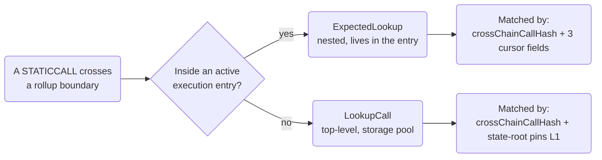

import UnauditedWarning from '../_unaudited-warning.mdx'

<UnauditedWarning />

A lookup call is a mechanism for crossing a rollup boundary to perform a **read-only query**. Instead of executing a state-changing cross-chain call, a lookup provides pre-recorded return data for a `STATICCALL` that would otherwise require reaching across chains. The prover computes the correct return value off-chain, records it in the execution entry or the lookup pool, and the on-chain machinery verifies it and hands it back to the caller.

Lookups also cover a second pattern: **reverting cross-chain calls**. When an L1 contract calls an L2 contract inside a `try/catch` and expects that call to revert, a lookup records the revert data and the sub-execution that produced it. Both static reads and reverting calls are resolved through the same lookup infrastructure.

EEZ has two distinct lookup structs that live in two different places, each serving a different context.

## Two Lookup Structs, Two Homes

| Struct | Lives in | Serves | Match key |
| --- | --- | --- | --- |
| `ExpectedLookup` | `ExecutionEntry.expectedLookups[]` (nested) | Reentrant static reads and try/catch'd reverting calls fired _inside_ an execution | `(crossChainCallHash, l2ToL1CallNumber, lastL1ToL2CallConsumed, executingLookupIndex)` |
| `LookupCall` | Storage pool: `_transientLookupCalls` / per-rollup `lookupQueue` (L1) or `lookupCalls` (L2) | Top-level static reads and top-level reverting calls, consumable only _outside_ an active execution | `crossChainCallHash` \+ all `expectedStateRoots` pins live (L1 only) |

This split is what makes lookups **entry-scoped by construction**. A nested `ExpectedLookup` can only be resolved from the specific execution entry (or top-level lookup sub-execution) that owns it — there is no shared queue to pollute, no cross-entry collision, and no cross-rollup routing concern.



## ExpectedLookup: Nested Lookups (In-Entry)

Use an `ExpectedLookup` when a contract performs a cross-chain read or a `try/catch`-wrapped reverting call **while an execution entry is already being processed**.

### Struct Definition (L1)

```solidity
struct ExpectedLookup {
    bytes32 crossChainCallHash;        // identity of the looked-up call
    uint256 destinationRollupId;       // rollup this looked-up call targets — verified at resolution
    bytes   returnData;                // returned on success / reverted-with on failure
    bool    failed;                    // false = static read, true = reverting sub-execution
    uint64  l2ToL1CallNumber;          // _currentL2ToL1Call cursor at the moment of observation
    uint64  lastL1ToL2CallConsumed;    // _lastL1ToL2CallConsumed cursor at observation
    uint64  executingLookupIndex;      // context at observation: 0 = entry level, k = inside lookup[k-1]
    L2ToL1Call[]         l2ToL1Calls;        // sub-calls executed at resolution
    ExpectedL1ToL2Call[] expectedL1ToL2Calls; // reentrant table for reverted-mode sub-execution
    uint256              callCount;    // top-level iteration count for reverted-mode real sub-executions
    bytes32 rollingHash;               // expected hash of executed sub-calls
}
```

### Two Modes

**Static mode (`failed == false`)**: The `CrossChainProxy` auto-detects `STATICCALL` context. When a contract calls a proxy using `STATICCALL`, EEZ routes to `staticCallLookup`. Inside an execution (`_insideExecution() == true`), `staticCallLookup` scans the active host's `expectedLookups[]` for the 4-tuple key `(crossChainCallHash, l2ToL1CallNumber, lastL1ToL2CallConsumed, executingLookupIndex)`. On match, it runs any sub-calls in `STATICCALL` context, verifies the untagged rolling hash, and returns `returnData`.

**Failed mode (`failed == true`)**: A reverting nested lookup is matched during execution and runs as a mini sub-execution, then reverts with `returnData`. The calling contract's `try/catch` observes the revert. This mode allows pre-computing the effect of a cross-chain call that you know will revert — for example, checking whether a remote operation is feasible without committing to it.

### Constraints

- Static lookups must have `callCount == 0` and an empty `expectedL1ToL2Calls` array. There is no partition to record.
- Reverted lookups with actual sub-calls (`l2ToL1Calls.length > 0`) require `callCount >= 1` and must satisfy the partition invariant: `callCount + Σ expectedL1ToL2Calls[i].callCount == l2ToL1Calls.length`.

### The executingLookupIndex Field

`executingLookupIndex` binds a nested lookup to its execution context:

- `0` means the lookup fires at the entry's top level (no nested sub-execution is active).
- `k` means the lookup fires inside the sub-execution of `expectedLookups[k-1]`.

EEZ enforces this on-chain at match time (`_insideRevertedLookup ? _revertedLookupIndex + 1 : 0`). This makes the flat `expectedLookups[]` table unambiguous across the entry and all of its sub-execution contexts.

### Example: Reading a Remote Balance In-Entry

Suppose an L1 contract calls `STATICCALL` on a proxy targeting an L2 token contract to read a balance mid-execution:

```solidity
// Inside an ExecutionEntry, an L1 contract does:
(bool ok, bytes memory result) = l2TokenProxy.staticcall(
    abi.encodeCall(IERC20.balanceOf, (account))
);
// EEZ resolves this from expectedLookups[i] where:
//   crossChainCallHash = keccak256(l2RollupId, l2Token, 0, balanceOf(account), caller, sourceRollupId)
//   failed = false
//   l2ToL1CallNumber = <current cursor>
//   lastL1ToL2CallConsumed = <current cursor>
//   executingLookupIndex = 0 (at entry level)
//   returnData = abi.encode(balance)
//   rollingHash = 0 (no sub-calls)
```

The prover pre-computes `balance` from the L2 state root committed in `StateDelta.newState`, records it as `returnData`, and embeds the `ExpectedLookup` in the entry. The on-chain verification confirms the hash is consistent.

## LookupCall: Top-Level Lookups (Storage Pool)

Use a `LookupCall` when a contract performs a cross-chain static read or a reverting call **outside any active execution** — that is, when `_insideExecution()` returns false.

### Struct Definition (L1)

```solidity
struct ExpectedStateRootPerRollup {
    uint256 rollupId;
    bytes32 stateRoot;
}

struct LookupCall {
    bytes32 crossChainCallHash;
    uint256 destinationRollupId;             // routes to lookupQueue[rollupId] on L1
    bytes   returnData;
    bool    failed;
    L2ToL1Call[]         l2ToL1Calls;
    ExpectedL1ToL2Call[] expectedL1ToL2Calls;
    ExpectedLookup[]     expectedLookups;    // nested lookups for reverted sub-executions
    uint256              callCount;
    bytes32 rollingHash;
    ExpectedStateRootPerRollup[] expectedStateRoots;  // state-root pins for match gating (L1 only)
}
```

Top-level lookups are published to the storage pool by `postAndVerifyBatch` (via `l1ToL2lookupCalls`) and are consumed when a `STATICCALL` crosses a chain boundary outside any execution. The match requires `crossChainCallHash` to match AND all `expectedStateRoots` pins to match the live `rollups[rollupId].stateRoot` for each pinned rollup.

On L2, the `LookupCall` struct drops `destinationRollupId` and `expectedStateRoots` entirely (single rollup, match is by `crossChainCallHash` alone). The pool is `lookupCalls`.

### State Root Binding (L1)

`expectedStateRoots[]` is the key L1-only feature of `LookupCall`. It content-addresses the lookup to a specific point on each pinned rollup's state trajectory:

```solidity
// This lookup only matches when all pins are live:
LookupCall memory lookup = LookupCall({
    crossChainCallHash: ...,
    destinationRollupId: 1,
    returnData: abi.encode(remoteBalance),
    failed: false,
    ...
    expectedStateRoots: [
        ExpectedStateRootPerRollup({ rollupId: 1, stateRoot: keccak256("l2-state-after-step-3") })
    ]
});
```

When `staticCallLookup` scans the pool outside an execution, it skips any candidate whose `expectedStateRoots` pins do not all equal their respective live state roots. This means you pin the lookup to a specific cross-rollup interleaving — the read is only valid at the exact point in the batch where those rollup states hold.

An empty `expectedStateRoots` array matches unconditionally, which is appropriate for reads that do not depend on any particular rollup state.

### How CrossChainProxy Routes to staticCallLookup

The `CrossChainProxy` is the on-chain gateway for all cross-chain calls. It auto-detects whether it is being invoked via `STATICCALL`:

- **Regular CALL** → routes to `executeCrossChainCall` on the EEZ manager. Triggers execution from the queue.
- **STATICCALL** → routes to `staticCallLookup` on the EEZ manager. Triggers lookup resolution.

This means any contract that calls a `CrossChainProxy` with `STATICCALL` (or `staticcall` in Solidity) automatically uses the lookup path. You do not need to call a different function or use a different proxy — the same proxy address handles both modes.

```solidity
// Regular cross-chain call (state-changing)
(bool ok, bytes memory ret) = crossChainProxy.call(calldata);

// Cross-chain view query (lookup)
(bool ok, bytes memory ret) = crossChainProxy.staticcall(calldata);
// ↑ EEZ routes this to staticCallLookup automatically
```

### Resolution Mechanics

`staticCallLookup` branches on `_insideExecution()`:

**Inside an execution** (nested lookup path):

```text
scan host's expectedLookups[] for:
  (crossChainCallHash, l2ToL1CallNumber, lastL1ToL2CallConsumed, executingLookupIndex)
→ run sub-calls via _processNStaticCalls (STATICCALL loop)
→ verify untagged rolling hash == rollingHash
→ return returnData (or revert with it if failed == true)
```

**Outside an execution** (top-level lookup path):

```text
if a transient batch is currently mid-flight (_transientExecutions.length != 0):
  scan _transientLookupCalls only
  (no match → revert ExecutionNotFound; the persistent queue is never consulted)
else:
  scan lookupQueue[destinationRollupId] only
    for crossChainCallHash AND all expectedStateRoots live
→ run sub-calls via _processNStaticCalls
→ verify untagged rolling hash
→ return returnData (or revert with it if failed == true)
```

On L2, `staticCallLookup` scans only the single `lookupCalls` pool by `crossChainCallHash` alone.

## L1 / L2 Differences at a Glance

| Feature | L1 (EEZ) | L2 (EEZL2) |
| --- | --- | --- |
| Top-level pool name | `lookupQueue[rollupId]` \+ `_transientLookupCalls` | `lookupCalls` |
| Match fields | `crossChainCallHash` \+ `expectedStateRoots` | `crossChainCallHash` only |
| `destinationRollupId` on `LookupCall` | Present (routes to correct queue) | Absent |
| `expectedStateRoots` | Present (L1-only) | Absent |
| Struct field names | L1-directional (`l2ToL1Calls`, `expectedL1ToL2Calls`) | Self-relative (`incomingCalls`, `expectedOutgoingCalls`) |
| Transient pool scan | L1 scans transient XOR persistent (whichever is active), never both | L2 scans only `lookupCalls` |

## Invariants Summary

When building lookup entries, follow these rules or the batch will revert on-chain:

- `failed == false` requires `callCount == 0`, `expectedL1ToL2Calls.length == 0`, and (for `LookupCall`) `expectedLookups.length == 0`.
- `callCount > 0` requires `failed == true` and the tagged hash schema.
- `callCount > 0` requires `callCount + Σ expectedL1ToL2Calls[i].callCount == l2ToL1Calls.length`.
- `l2ToL1Calls.length > 0` with `callCount == 0` is invalid for failed lookups (`UnconsumedL2ToL1Calls` would fire).
- Static sub-calls use the **untagged** hash (`keccak256(prev, success, retData)` per sub-call); failed sub-executions use the **tagged** hash.
- A nested `ExpectedLookup` resolves only from the active host's `expectedLookups[]`.
- A `LookupCall` resolves only when `!_insideExecution()`.

:::note
For top-level lookups, the prover decides which rollups to pin in `expectedStateRoots`. An empty array is valid and matches unconditionally. Pin aggressively when the cached read must be consistent with a specific cross-rollup interleaving; omit pins for reads that are state-independent.
:::